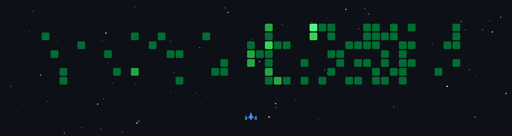

## Hi, I'm LCS😄

The hall of information about me (I dump anything that shows information about me on here)



<picture>
  <source
    media="(prefers-color-scheme: dark)"
    srcset="https://raw.githubusercontent.com/LCSOGthb/LCSOGthb/refs/heads/github-breakout/images/breakout-dark.svg"
  />
  <source
    media="(prefers-color-scheme: light)"
    srcset="https://raw.githubusercontent.com/LCSOGthb/LCSOGthb/refs/heads/github-breakout/images/breakout-light.svg"
  />
  
</picture>


---


---
<!--START_SECTION:waka-->


**🐱 My GitHub Data** 

> 📦 192.0 kB Used in GitHub's Storage 
 > 
> 🏆 408 Contributions in the Year 2026
 > 
> 🚫 Not Opted to Hire
 > 
> 📜 16 Public Repositories 
 > 
> 🔑 0 Private Repositories 
 > 
**I'm an Early 🐤** 

```text
🌞 Morning                576 commits         ██████░░░░░░░░░░░░░░░░░░░   23.04 % 
🌆 Daytime                753 commits         ████████░░░░░░░░░░░░░░░░░   30.12 % 
🌃 Evening                969 commits         ██████████░░░░░░░░░░░░░░░   38.76 % 
🌙 Night                  202 commits         ██░░░░░░░░░░░░░░░░░░░░░░░   08.08 % 
```
📅 **I'm Most Productive on Thursday** 

```text
Monday                   462 commits         █████░░░░░░░░░░░░░░░░░░░░   18.48 % 
Tuesday                  173 commits         ██░░░░░░░░░░░░░░░░░░░░░░░   06.92 % 
Wednesday                417 commits         ████░░░░░░░░░░░░░░░░░░░░░   16.68 % 
Thursday                 548 commits         █████░░░░░░░░░░░░░░░░░░░░   21.92 % 
Friday                   385 commits         ████░░░░░░░░░░░░░░░░░░░░░   15.40 % 
Saturday                 224 commits         ██░░░░░░░░░░░░░░░░░░░░░░░   08.96 % 
Sunday                   291 commits         ███░░░░░░░░░░░░░░░░░░░░░░   11.64 % 
```


📊 **This Week I Spent My Time On** 

```text
💬 Programming Languages: 
No Activity Tracked This Week

🔥 Editors: 
No Activity Tracked This Week

🐱‍💻 Projects: 
No Activity Tracked This Week

💻 Operating System: 
No Activity Tracked This Week
```

**I Mostly Code in Java** 

```text
TypeScript               3 repos             ███░░░░░░░░░░░░░░░░░░░░░░   11.11 % 
HTML                     2 repos             ██░░░░░░░░░░░░░░░░░░░░░░░   07.41 % 
CSS                      2 repos             ██░░░░░░░░░░░░░░░░░░░░░░░   07.41 % 
Rust                     2 repos             ██░░░░░░░░░░░░░░░░░░░░░░░   07.41 % 
JavaScript               1 repo              █░░░░░░░░░░░░░░░░░░░░░░░░   03.70 % 
```


**Timeline**


 Last Updated on 30/06/2026 20:29:07 UTC
<!--END_SECTION:waka-->
